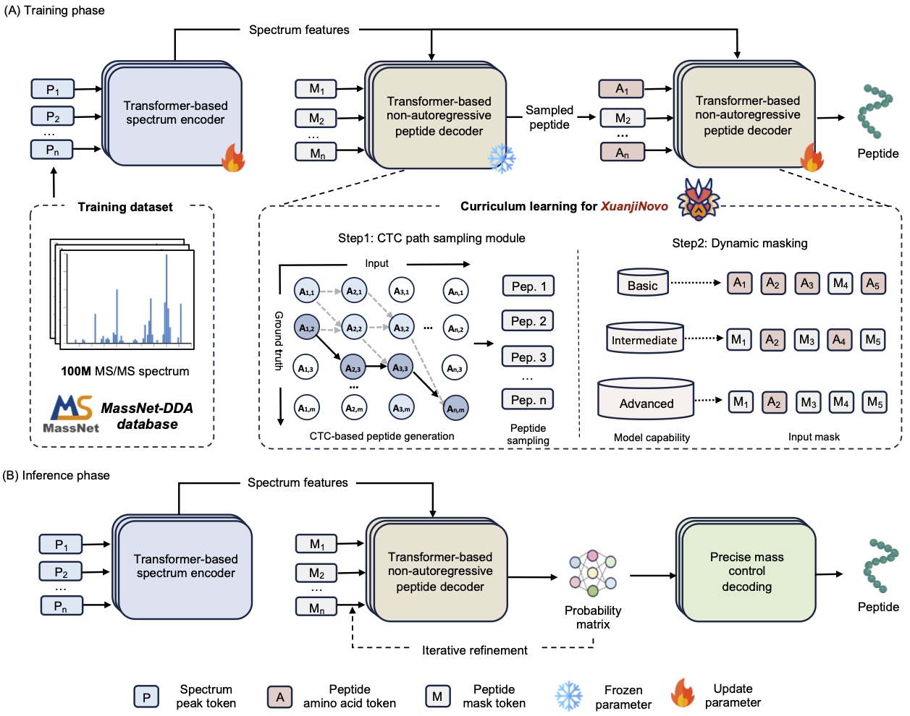

# Overview

MassNet is a large-scale data resource for deep learning–based proteomics, providing curated data-dependent acquisition (DDA) mass spectrometry data across multiple species for AI model development. 
It defines the **Mass Spectrometry DDA Tensor (MSDT)**, a Parquet-based logical data format designed for standardized data organization, sharing, and long-term storage. Building on this data resource, 
we developed XuanjiNovo, a non-autoregressive Transformer model for de novo peptide sequencing. **XuanjiNovo** uses MSDT-formatted datasets as its primary training input and performs an internal conversion 
to LMDB as a high-performance physical loading format, enabling efficient large-scale training and inference. Trained on **100** million peptide-spectrum matches from MassNet, XuanjiNovo achieves robust and 
scalable performance across heterogeneous MS/MS datasets. 

To facilitate data preparation and adoption, we provide a dedicated data conversion toolkit that enables seamless transformation of commonly used MS file formats—including mzML, MGF, and Bruker native .d 
files—into the unified MSDT format optimized for AI model training (https://github.com/guomics-lab/MSDT-Converter). Detailed documentation of the MSDT format is available on our website at https://guomics.com/software/massnet/msdt.html.

## XuanjiNovo

 

### Platform Support

- **Linux**: Fully supported and tested
- **Windows**: Supported with WSL2 (Windows Subsystem for Linux) or native installation
- **macOS**: Not supported due to CuPy requirement for CUDA GPU acceleration. CuPy requires CUDA Toolkit, which is not
  available on macOS due to lack of NVIDIA GPU support.

The time estimated for setting up is 10-20 minutes depending on network speed and platform.

The algorithm can peform evaluation/ De novo with a speed of roughly 280 spectra per-GPU, tested with Nvidia-H200.

# Environment Setup

We provide both Docker and Conda set-up guide, user can choose between option A: Docker and option B: Conda below:

## Option A: Docker

Python version: 3.10

> **⚠️Note**: This Docker container includes only the runtime environment — no models are included! Please make sure you
> have downloaded the required models from the official or designated sources and loaded them correctly as described in
> the documentation.

To run this project with Docker, you can choose one of the following two options.

### Option A.1: Use a Pre-built Docker Image (Recommended)

You can directly pull the pre-built image from Docker Hub:

```bash
# Pull the CUDA 11 version
docker pull guomics2017/massnet-dda:cuda11_v1.0

# Pull the CUDA 12 version
docker pull guomics2017/massnet-dda:cuda12_v1.0

```

### Option A.2: Build the Docker Image Locally

```bash
# Change directory to MassNet-DDA
cd MassNet-DDA

# CUDA 11 version
docker build -t massnet-dda:cuda11_v1.0 . -f Dockerfile_cuda11

# CUDA 12 version
docker build -t massnet-dda:cuda12_v1.0 . -f Dockerfile_cuda12
```

## Option B: Conda

Create a new conda environment first:

```
conda create --name XuanjiNovo python=3.10
```

This will create an anaconda environment

Activate this environment by running:

```
conda activate XuanjiNovo
```

then install dependencies:

```
pip install -r ./requirements.txt
```

**You need install torch from pytorch (https://pytorch.org/)**. It is advisable to install the entire pytorch package and follow the official installation method provided by pytorch.
Specifically, first select the CUDA version according to your own operating system, and then, based on the CUDA version, choose the corresponding installation command to execute. For example, run "pip install torch==2.1.0 torchvision==0.16.0 torchaudio==2.1.0 --index-url https://download.pytorch.org/whl/cu121". You can check the installed CUDA version by running the nvcc --version command.
> **⚠️Note**: The torch version should be 2.1.0.


installing gcc and g++:

```bash
conda install -c conda-forge gcc==11.4
conda install -c conda-forge cxx-compiler
```

then install ctcdecode, which is the package for ctc-beamsearch decoding


```bash
cd ctcdecode-master
pip install .
cd .. 
```

If pip install . fails(No module named 'torch'), try installing with
```bash
pip install . --no-build-isolation
```
to avoid potential dependency conflicts.

(if there are no errors, ignore the next block and proceed to CuPy install)

--------------------

    **Troubleshooting**

if you encountered issues with C++ (gxx and gcc) version errors in above step, install gcc with version specified as :

```bash
conda install -c conda-forge gcc_linux-64=11.4
```

Notes on Installing ctcdecoder:

When installing ctcdecoder (via pip install .), make sure that your CUDA and GCC versions are compatible. For example,
CUDA 12.1 officially supports up to GCC 12.2. You can find this information in the official CUDA documentation:

https://docs.nvidia.com/cuda/archive/12.1.0/cuda-installation-guide-linux/

If the versions are not compatible, the installation may fail.

----------------------

then install pytorch imputer for CTC-curriculum sampling

```bash
cd imputer-pytorch
pip install -e .
cd ..
```

lastly, install CuPy to use our CUDA-accelerated precise mass-control decoding:


**_Please install the following Cupy package in a GPU available env, If you are using a slurm server, this means you have
to enter a interative session with sbatch to install Cupy, If you are using a machine with GPU already on it (checking
by nvidia-smi), then there's no problem_**

**Check your CUDA version using command nvidia-smi, the CUDA version will be on the top-right corner**

| cuda version                    | command                  |
|---------------------------------|--------------------------|
| v10.2 (x86_64 / aarch64)        | pip install cupy-cuda102 |
| v11.0 (x86_64)                  | pip install cupy-cuda110 |
| v11.1 (x86_64)                  | pip install cupy-cuda111 |
| v11.2 ~ 11.8 (x86_64 / aarch64) | pip install cupy-cuda11x |
| v12.x (x86_64 / aarch64)        | pip install cupy-cuda12x |

## Model Settings

Some of the important settings in config.yaml under ./XuanjiNovo

### Decoding Parameters

**n_beam**: Number of CTC-paths (beams) considered during inference. We recommend a value of 40. Controls the beam width
during decoding, with higher values exploring more potential sequences at the cost of increased computation time.

**refine_iters**: Number of refinement iterations performed during forward pass (default: 3). Controls how many times
the model refines its predictions. Higher values can lead to more refined predictions but increase computation time.

**mass_control_tol**: This setting is only useful when **PMC_enable** is ```True```. The tolerance of PMC-decoded mass
from the measured mass by MS, when mass control algorithm (PMC) is used. For example, if this is set to 0.1, we will
only obtain peptides that fall under the mass range [measured_mass-0.1, measured_mass+0.1]. ```Measured mass``` is
calculated by : (pepMass - 1.007276) * charge - 18.01. pepMass and charge are given by input spectrum file (MGF).

**PMC_enable**: Whether to use PMC decoding unit or not, either ```True``` or ```False```.

### Training Parameters

**mask_schedule**: Controls the dynamic masking schedule during training through three parameters:

- **initial_peek** (default: 0.93): Initial peek factor at the start of training
- **epoch_decay** (default: 0.01): How much to reduce peek factor per epoch
- **min_peek** (default: 0.00): Minimum peek factor (won't decay below this)

The peek factor at any epoch is calculated as: max(initial_peek - current_epoch * epoch_decay, min_peek). This schedule
controls the curriculum learning process, where higher initial_peek means more teacher forcing at the start, higher
epoch_decay means faster transition to self-learning, and higher min_peek maintains some minimum level of teacher
forcing.

**n_peaks**: Number of the most intense peaks to retain, any remaining peaks are discarded. We recommend a value of 800.

**min_mz**: Minimum peak m/z allowed, peaks with smaller m/z are discarded. We recommend a value of 1.

**max_mz**: Maximum peak m/z allowed, peaks with larger m/z are discarded. We recommend a value of 6500.

**min_intensity**: Min peak intensity allowed, less intense peaks are discarded. We recommend a value of 0.0.

### Logging Configuration

**log_level**: Controls the verbosity of the model's logging output. Available levels (from most to least verbose):

- `DEBUG`: Detailed information for debugging and development
- `INFO`: General information about model operation (default)
- `WARNING`: Only potentially concerning situations
- `ERROR`: Only error messages that affect operation
- `CRITICAL`: Only critical errors that prevent operation

For minimal logging output (e.g., in production), use `ERROR` or `CRITICAL`. For development and debugging, use `DEBUG`
or `INFO`. Example in config.yaml:

```yaml
# Logging configuration
log_level: "ERROR"  # Minimal logging for production use
```

## Run Instructions

**Note!!!!!!!!!!!!!!!!!!:** All the following steps should be performed under the main directory. Do **not** use
`cd XuanjiNovo` !!!!!!!!!!!!!!!!!!!

### Step 1: Download Required Files

We provide multiple alternative download methods for model checkpoints and test data. The `download_data.py` supports both **Google Drive** and **HTTPS mirrors**, 
with SHA-256 checksum verification to ensure file integrity, and automatically falls back to alternative sources if the primary download fails. In environments 
where Google Drive access is unreliable or external tools such as gdown are not available, we recommend using HTTPS mirrors hosted on Hugging Face or performing 
manual downloads using standard command-line tools such as **wget** or **curl**.  

#### Available Files:

1. **Model Checkpoints**:
    - `XuanjiNovo_100M_massnet.ckpt`: Base model trained on MassNet
    - `XuanjiNovo_130M_massnet_massivekb.ckpt`: Model finetuned on 30M MassiveKB
2. **Test Data**:
    - `bacillus.10k.mgf`: Test MGF file
	- `msdt_demo.zip`: Test MSDT file

#### Automatic Download:

```bash
# Install download dependencies
pip install gdown requests tqdm

# Download all files (uses Google Drive by default)
python download_data.py

# Download specific files
python download_data.py --files XuanjiNovo_100M_massnet.ckpt bacillus.10k.mgf

# Use HTTPS mirrors instead of Google Drive
python download_data.py --prefer-mirror

# Specify output directory
python download_data.py --output-dir ./data
```

The script will:

1. Download files from either Google Drive or HTTPS mirrors
2. Verify SHA-256 checksums to ensure file integrity
3. Skip already downloaded files if checksums match
4. Automatically retry with alternative source if primary source fails

#### Manual Download:

If you prefer manual downloads, you can use either Google Drive or Hugging Face links:

**Google Drive Links:**

1. [XuanjiNovo_100M_massnet.ckpt](https://drive.google.com/file/d/1BtEYZ9FuWvQub2YQEHYMy5l2Y7bcmQDr/view?usp=sharing)
2. [XuanjiNovo_130M_massnet_massivekb.ckpt](https://drive.google.com/file/d/1dcbdn5tV5x2tmUKT7nJe8deqMwGzpx4E/view?usp=sharing)
3. [bacillus.10k.mgf](https://drive.google.com/file/d/1HqfCETZLV9ZB-byU0pqNNRXbaPbTAceT/view?usp=drive_link)
4. [msdt_demo.zip](https://drive.google.com/file/d/1IrR8LGbhK9bsd7rr5M4Yi-rig9qCpqxh)

**Hugging Face Links:**
All files are also available in our [Hugging Face repository](https://huggingface.co/Wyattz23/XuanjiNovo):

1. [XuanjiNovo_100M_massnet.ckpt](https://huggingface.co/Wyattz23/XuanjiNovo/resolve/main/XuanjiNovo_100M_massnet.ckpt)
2. [XuanjiNovo_130M_massnet_massivekb.ckpt](https://huggingface.co/Wyattz23/XuanjiNovo/resolve/main/XuanjiNovo_130M_massnet_massivekb.ckpt)
3. [bacillus.10k.mgf](https://huggingface.co/Wyattz23/XuanjiNovo/resolve/main/bacillus.10k.mgf)
4. [msdt_demo.zip](https://huggingface.co/Wyattz23/XuanjiNovo/resolve/main/msdt_demo.zip)

```bash
# Download model checkpoint from Hugging Face using wget
wget -O XuanjiNovo_100M_massnet.ckpt "https://huggingface.co/Wyattz23/XuanjiNovo/resolve/main/XuanjiNovo_100M_massnet.ckpt"

# Or download using curl
curl -L -o XuanjiNovo_100M_massnet.ckpt "https://huggingface.co/Wyattz23/XuanjiNovo/resolve/main/XuanjiNovo_100M_massnet.ckpt"
```

After manual download, (optional) verify file integrity:

```bash
# View expected checksums
cat checksums.txt

# Calculate checksum of downloaded file
sha256sum XuanjiNovo_100M_massnet.ckpt
```

### Command-Line Interface and Configuration

XuanjiNovo supports two ways to configure its behavior:

1. **config.yaml**: The primary configuration file where you can set all parameters
2. **Command-line arguments**: Override specific config.yaml settings for quick adjustments

Command-line arguments take precedence over config.yaml settings. For example, if you set `n_beams: 40` in config.yaml
but run with `--n-beams 60`, the value 60 will be used.

Here's the complete help output for command-line options:

```
Usage: python -m XuanjiNovo.XuanjiNovo [OPTIONS]

Options:
  --mode TEXT                  Operation mode: 'eval' for labeled data evaluation,
                              'denovo' for unlabeled data analysis [required]
  
  --peak_path TEXT           Path to input peak files, supporting MGF and MSDT (Parquet) formats [required]
  
  --peak_path_val TEXT       Path to validation data in MGF or MSDT (Parquet) format. Only used in training mode
  
  --peak_path_test TEXT      Path to test data in MGF or MSDT (Parquet) format. Only used in training mode
  
  --model TEXT               Path to model checkpoint file [required]
  
  --config TEXT              Path to config file (default: config.yaml)
  
  --output TEXT              Path to output directory (default: current directory)
  
  --batch_size INTEGER       Batch size for inference (default: from config)
  
  --n_beams INTEGER         Number of beams for CTC beam search (default: from config)
  
  --pmc-enable/--no-pmc-enable
                              Enable/disable Precise Mass Control module (default: from config)
  
  --mass_control_tol FLOAT  Mass tolerance for PMC module (default: from config)
  
  --refine_iters INTEGER    Number of refinement iterations (default: from config)
  
  --gpu TEXT                Comma-separated list of GPU IDs to use (default: all available)
  
  --help                    Show this help message and exit

Examples:
  # Evaluate labeled data
  python -m XuanjiNovo.XuanjiNovo --mode=eval --peak_path=./data.mgf --model=./model.ckpt

  # De novo analysis of unlabeled data with custom settings
  python -m XuanjiNovo.XuanjiNovo --mode=denovo --peak_path=./unknown.mgf --model=./model.ckpt \
      --PMC_enable=True --mass_control_tol=0.1 --refine_iters=3 --n_beams=40

  # Use specific GPUs (multi-GPU requires torchrun)
  torchrun --nproc_per_node=2 -m XuanjiNovo.XuanjiNovo --mode=eval --peak_path=./data.mgf --model=./model.ckpt --gpu=0,1

Notes:
- The 'eval' mode requires labeled data and provides evaluation metrics
- The 'denovo' mode is for unlabeled data analysis
- All parameters can be set in config.yaml and optionally overridden via command line
- Command-line arguments take precedence over config.yaml settings
- GPU memory requirements depend on batch size and number of beams
- For permanent changes, prefer updating config.yaml
- Use command-line arguments for temporary overrides or quick experiments
```

# Running the Model

## Example Run Command with Docker (If you are using Docker)

Below is an example command to run the container (using the CUDA 11 version):

```bash
docker run --gpus all --rm \
  -v /local/data:/data \
  massnet-dda:cuda11_v1.0 \
  --mode=eval \
  --peak_path=/data/bacillus.10k.mgf \
  --model=/data/XuanjiNovo_100M_massnet.ckpt \
  --output /data/output_cuda11_v1.0
```

> **⚠️Note**: The -v flag ​​maps​​ the directory /local/data on the host machine to the path /data inside the docker.
> Please change /local/data to the actual path on your local machine where the data and model weights are stored.

## Example Run Command with Conda

Execute the command with your desired options. For example:

### Evaluation mode:
```bash
# Basic evaluation with setting from file config.yaml in default directory
## Example 1: MGF input
python -m XuanjiNovo.XuanjiNovo --mode=eval --peak_path=./bacillus.10k.mgf --model=./XuanjiNovo_100M_massnet.ckpt

## Example 2: MSDT (Parquet) input
python -m XuanjiNovo.XuanjiNovo --mode=eval --peak_path=./demo2_fp.parquet --model=./XuanjiNovo_100M_massnet.ckpt
```

### DeNovo mode:

```bash
python -m XuanjiNovo.XuanjiNovo --mode=denovo --peak_path=./bacillus.10k.mgf --model=./XuanjiNovo_100M_massnet.ckpt --output ./demo_output
```

XuanjiNovo supports inference on **multiple input files in a single run**. Imput files can be specified by concatenating file paths with the **"&"**. For example: 
```bash
python -m XuanjiNovo.XuanjiNovo --mode=denovo --peak_path="./sample1.mgf&./sample2.mgf&./sample3.mgf" --model=./XuanjiNovo_100M_massnet.ckpt --output ./demo_output
```
In this case, all specified files will be processed sequentially using the same model and configuration, and the inference results from all input files will be aggregated and written to a single output file.  

> **⚠️Note**: The --output argument expects a **directory path** rather than a file path. If this argument is specified, please ensure that the target directory does not already exist, as it will be created during execution.

### Training mode

```bash
python -m XuanjiNovo.XuanjiNovo --mode=train --peak_path=./train_file.parquet --peak_path_val=./validation_file.mgf --peak_path_test=./bacillus.mgf  
```


The model supports both single-GPU and multi-GPU execution. For multi-GPU training and inference, you must use
`torchrun` instead of `python`:

```bash
# Single GPU usage
python -m XuanjiNovo.XuanjiNovo --mode=eval --gpu=0    # Use only GPU 0

# Multi-GPU usage with torchrun
# Note: --nproc_per_node should match the number of GPUs you want to use
torchrun --nproc_per_node=2 -m XuanjiNovo.XuanjiNovo --mode=eval --gpu=0,1  # Use 2 GPUs (0,1)
torchrun --nproc_per_node=4 -m XuanjiNovo.XuanjiNovo --mode=eval --gpu=0,1,2,3  # Use 4 GPUs
torchrun --nproc_per_node=8 -m XuanjiNovo.XuanjiNovo --mode=eval  # Use all 8 GPUs

# Examples with full command:
# Training on 2 GPUs
torchrun --nproc_per_node=2 -m XuanjiNovo.XuanjiNovo \
    --mode=train \
    --peak_path=./training_data.mgf \
    --model=./model.ckpt \
    --gpu=0,1

# Evaluation on 4 GPUs
torchrun --nproc_per_node=4 -m XuanjiNovo.XuanjiNovo \
    --mode=eval \
    --peak_path=./test_data.mgf \
    --model=./model.ckpt \
    --gpu=0,1,2,3
```

Important notes for multi-GPU usage:

- The `--nproc_per_node` value must match the number of GPUs specified in `--gpu`
- Training batch size is automatically scaled by the number of GPUs
- Data is distributed across GPUs using PyTorch's DistributedDataParallel
- Memory usage is balanced across selected GPUs
- For optimal performance, ensure all specified GPUs have similar specifications

## Development Setup

For developers who want to contribute to the project, we have additional tools for code quality and consistency:

1. Install development dependencies:

```bash
pip install -r requirements-dev.txt
```

2. Set up pre-commit hooks:

```bash
pre-commit install
```

This will set up automatic checks that run before each commit:

- Code formatting with `black`
- Import sorting with `isort`
- Linting with `flake8`
- Static type checking with `mypy`
- Other checks like trailing whitespace and file endings

To run the checks manually on all files:

```bash
pre-commit run --all-files
```

## Unit test

To ensure the correctness of core components, we provide unit tests based on the pytest framework.

1. Install pytest:

```bash

pip install pytest
```


2. Run a specific test (e.g., de novo peptide processing):

```bash
pytest tests/test_denovo.py::test_denovo_process -v -s

```
